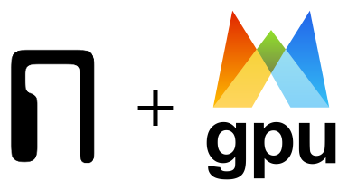
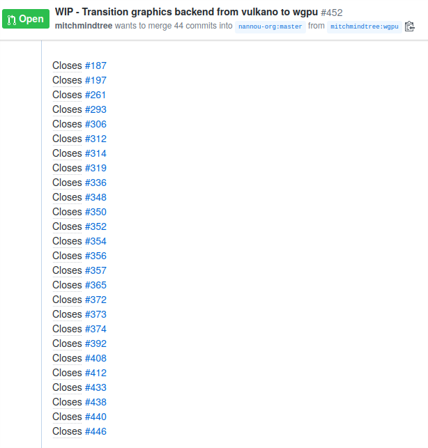

<br>

**Nannou** is an open source, creative coding framework for Rust. Today marks
one of the biggest milestones for the project since its launch - the release of
version **0.13**.

This version is particularly special for our community as it opens the
floodgates for a lot of pending graphics work and paves the road ahead for
running nannou on the web!
<br>

<iframe src="https://player.vimeo.com/video/395473029?autoplay=1&loop=1&autopause=0?muted=1&background=1" width="640" height="268" frameborder="0" allow="autoplay; fullscreen" allowfullscreen></iframe>

<i>Daily Sketch 1219 by <a href="https://www.instagram.com/mactuitui/" target="_blank">Mactuitui</a> using nannou.</i>

While the main focus was graphics, this release also lands some serious patches
and long-desired features. We'll cover this and more.

- [WebGPU](#WebGPU)
- [Capturing Frames & Textures](#Capturing-Frames-&-Textures)
- [What's Next?](#Whats-Next)
- [RustFest BCN](#RustFest-BCN)
- [Join Us!](#Join-Us)


## WebGPU

[WebGPU](https://en.wikipedia.org/wiki/WebGPU) is a new cross-platform standard
for working with hardware accelerated graphics and compute. Despite having "Web"
in the name, the standard lends itself incredibly well as a portable *native*
solution for working with the GPU.



With 0.13, nannou gains support for this new standard via **wgpu-rs** - a Rust
implementation of the standard driven by the [gfx-rs](https://github.com/gfx-rs)
community. Adopting wgpu results in a whole suite of nice new benefits for
nannou users.

### Running on the web!

**wgpu** provides a promising path forward to running nannou on the web! WebGPU
is [in the process of being implemented by all major
browsers](https://github.com/gpuweb/gpuweb/wiki/Implementation-Status) and
provides exciting new opportunities for easily sharing serious graphics and
compute projects. While the web target is not quite ready today, the path ahead
for running nannou sketches and apps online looks promising! You can track
progress on the web target
[here](https://github.com/gfx-rs/wgpu-rs/issues/101).

### Nicer native macOS experience

**wgpu** targets Metal on macOS directly, rather than going through MoltenVK.
This alone greatly simplifies the build process on macOS and closes around 20%
of nannou's open issues!



### WebGPU Community

The WebGPU standard has a vibrant and active community surrounding it and
wgpu-rs has already been adopted by [a number of
projects](https://github.com/gfx-rs/wgpu-rs#friends) over the past few years.
The developers have been incredibly supportive making the adoption process very
easy. <b><a href="https://github.com/kvark" target="_blank">kvark</a></b> especially has been an exceptional help, and even has a commit in
the new release. 0.13 would likely be another week or two away if it was not for
your support, so thank you!

## Capturing Frames & Textures

With the release of 0.13, nannou users can now easily and efficiently capture
frames and save them to a file. This makes it much easier to screenshot, record
and share sketches.

You can capture the next frame in its final state right before it is presented
to the window like this:

```rust
window.capture_frame(path);
```
</br>
You can call this method at any time during your application, for example on a
`key_pressed` event to take a screenshot, or during the `update` or `view` to
capture every frame into a sequence. See the <b><a href="https://github.com/nannou-org/nannou/blob/master/examples/simple_capture.rs" target="_blank">simple_capture.rs example</a></b> for a demonstration.

</br>
</br>

<iframe src="https://player.vimeo.com/video/395467841?autoplay=1&loop=1&autopause=0?muted=1&background=1" width="640" height="640" frameborder="0" allow="autoplay; fullscreen" allowfullscreen></iframe>

<i>Daily Sketch 1220 by <a href="https://www.instagram.com/mactuitui/" target="_blank">Mactuitui</a>, updated for 0.13 and captured using this approach.</i>

Sometimes its useful to capture your sketch at a much higher resolution than
what your window can support, especially stills intended for print. Nannou now
also supports this case by allowing users to draw to a much larger texture,
capturing it with the new `TextureCapturer` type and simultaneously downscaling
for preview within the window. See the <b><a href="https://github.com/nannou-org/nannou/blob/master/examples/capture_hi_res.rs" target="_blank">capture\_hi\_res.rs example</a></b> for a demonstration of this.

## What's Next?

Adopting **wgpu-rs** opens the door for a range of graphics-related updates that
have been awaiting the overhaul. These include:

- **Draw API improvements:** Nannou's `Draw` API has been missing the ability to
  easily draw images, switch between blend modes, apply group transformations
  and take advantage of the glyph cache when rendering text. These are all much
  more easily addressable now that 0.13 has landed.
- **Update to lyon 0.15** Nannou's 2D vector graphics are based on the excellent
  [lyon crate](https://github.com/nical/lyon). We are looking forward to
  updating to the latest version and adopting the fancy [new
  tessellator](https://nical.github.io/posts/new-tessellator.html).
- **A friendly way of working with shaders:** We would love to provide a super
  easy and simple API for loading custom shaders, perhaps with a shader-toy
  inspired approach that allows for easily targeting arbitrary textures.

## RustFest BCN

Although it was a few months ago now, we wanted to use this opportunity to
mention that we had a great time at the RustFest BCN workshop! We were
overwhelmed by the attendance, and would like to apologise to those who couldn't
find a seat or spare power socket due to the packed room.

<blockquote class="twitter-tweet tw-align-center"><p lang="en" dir="ltr">Lasers and LEDs at the Creative Coding Workshop with <a href="https://twitter.com/nannoucc?ref_src=twsrc%5Etfw">@nannoucc</a> at <a href="https://twitter.com/hashtag/rustfest?src=hash&amp;ref_src=twsrc%5Etfw">#rustfest</a> <a href="https://t.co/NhHWUELyBX">pic.twitter.com/NhHWUELyBX</a></p>&mdash; Sophie G (@rarity2017) <a href="https://twitter.com/rarity2017/status/1193213060598697985?ref_src=twsrc%5Etfw">November 9, 2019</a></blockquote> 

Thanks to Sophie for capturing this moment!

If you are interested in organising a nannou workshop near you, feel free to get
in touch via [contact@nannou.cc](mailto:contact@nannou.cc).

## Join Us!

Since we announced the project almost a year and a half ago, nannou has grown
from a small three-person team into a small community. Feel free to join us!

Most of us hang out in the [nannou
slack](https://communityinviter.com/apps/nannou/nannou-slack) and would be more
than happy to meet you and chat about all things creative coding and nannou :)

Whether you made a fancy sketch or just got an ellipse drawing to the screen,
feel free to share it with us on twitter
[@nannoucc](https://twitter.com/nannoucc)! The
[#nannou](https://twitter.com/search?q=%23nannou&src=typed_query) hashtag also
has lots of awesome creations from the community.

<iframe src="https://player.vimeo.com/video/395475125?autoplay=1&loop=1&autopause=0?muted=1&background=1" width="640" height="268" frameborder="0" allow="autoplay; fullscreen" allowfullscreen></iframe>

<i>Daily Sketch 0114 by <a href="https://www.instagram.com/mactuitui/" target="_blank">Mactuitui</a></i>

<br>

If you would like to help us spend more time on nannou, consider becoming a
contributor at [our Open Collective page](https://opencollective.com/nannou).

<br>
<br>
<center>Get started with nannou <b><a href="https://guide.nannou.cc/" target="_blank">here</a></b>!</center>
<br>
<br>
