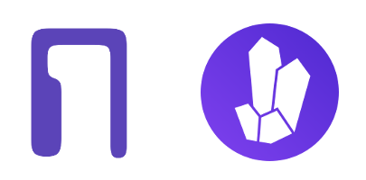

*[**Nannou**](https://nannou.cc/) is a creative coding framework that aims to
make it easy for artists to express themselves with simple, fast, reliable
code.*

It is our great pleasure to announce that **Nannou has been awarded 10K USD in
funding as a part of the [MOSS Mission
Partners](https://www.mozilla.org/en-US/moss/mission-partners/) track**. The
proposed work is aimed towards improving the state of some foundational crates
within the Rust audio ecosystem over the next three to four months.  Key areas
of our work will include:

- Addressing some long-standing issues in
  [CPAL](https://github.com/rustaudio/cpal).
- Review and improve CPAL's web audio support.
- Implement a simple web app and guide demonstrating CPAL's web audio support.
- Design, develop and document a standard audio graph abstraction and crate,
  reflecting on lessons learned and limitations of prior efforts, and the
  requirements of the wider rust audio community.

We look forward to empowering both Nannou users and the wider Rust audio
ecosystem with this work. I, [mitchmindtree](https://github.com/mitchmindtree)
on GitHub, will be doing the majority of CPAL design and development within the
issue tracker and pull requests at [CPAL's Github
repository](https://github.com/rustaudio/cpal) where those interested will be
free to review and provide feedback. In around two months after the CPAL work is
addressed, we will begin to tackle the audio graph work. At this point, we will
post an update with our plans and solicit feedback from the various branches of
the rust audio community before moving ahead.

### Acknowledgements

Thank you Mozilla and the MOSS team for giving us this opportunity and including
us as a Mission Partner! We look forward to diving into the work and doing our
best to become a positive example of what funding OSS development can achieve
for the wider community.

Thank you Erlend and the [Amethyst](https://amethyst.rs/) team for reaching out
and encouraging us to apply! Without your encouragement, demonstration of prior
success, and enthusiasm for the proposed work we likely would not have taken the
time to apply. The Nannou and Amethyst projects share a significant amount of
upstream code and will share more as Nannou plans to adopt
[rendy](https://github.com/amethyst/rendy) in the near future. We believe taking
the time to communicate, collaborate and encourage one another is the path
forward for OSS and we look forward to continuing to do so with the Amethyst
team.

### Supporting Nannou

While this contribution marks a significant milestone in Nannou's quest for
sustainability, we still have a long way to go. If you are interested in
supporting Nannou's development, please consider becoming a contributor at [our
open collective page](https://opencollective.com/nannou).

If you would like to get to know our community a little better or simply hang
out with some like-minded creative coders, feel free to [join us on
slack](https://communityinviter.com/apps/nannou/nannou-slack)!

### RustFest Reminder

Josh and I will be giving a workshop on creative coding with Nannou at
[RustFest Barcelona](https://barcelona.rustfest.eu/) next month! We hope to
see you there!
 
 
 
<3 Mitch and the nannou team
